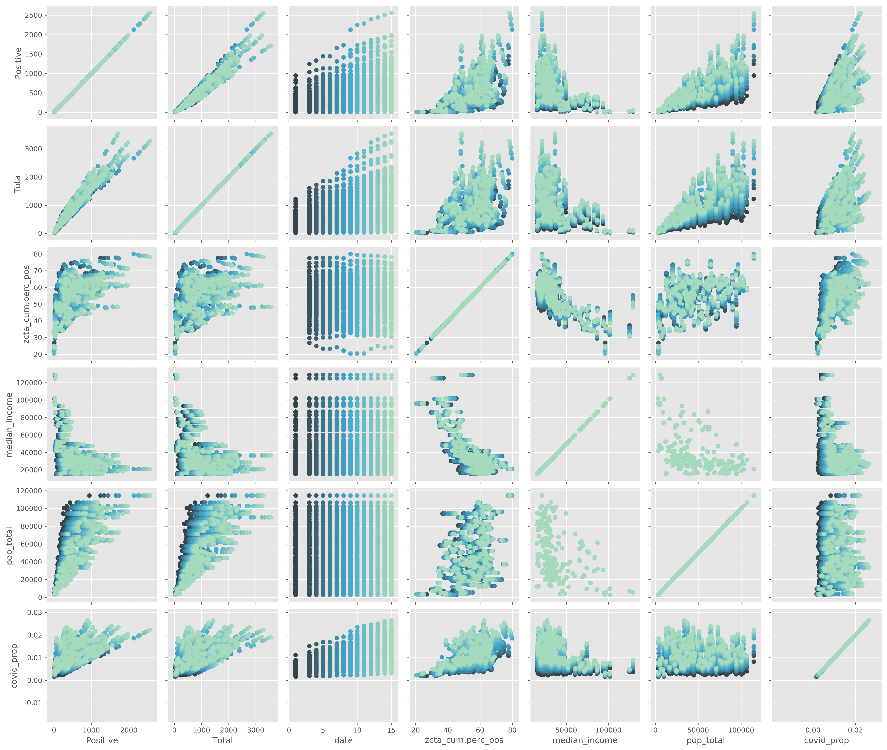
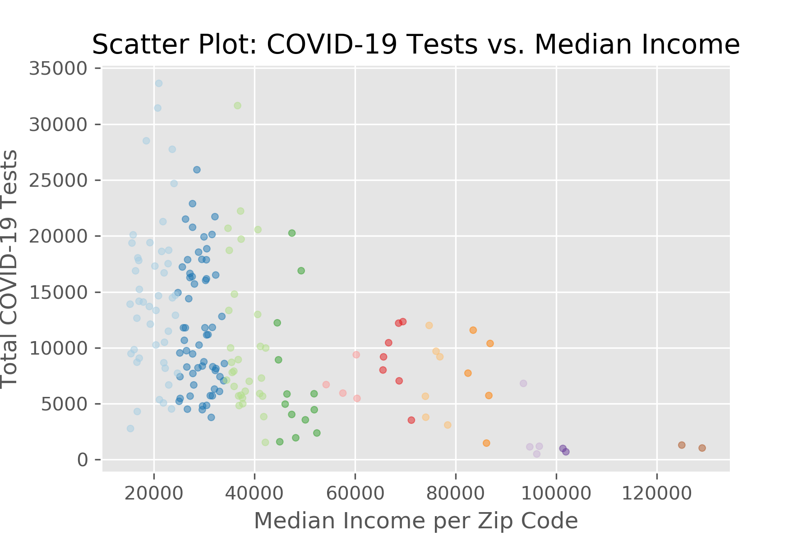
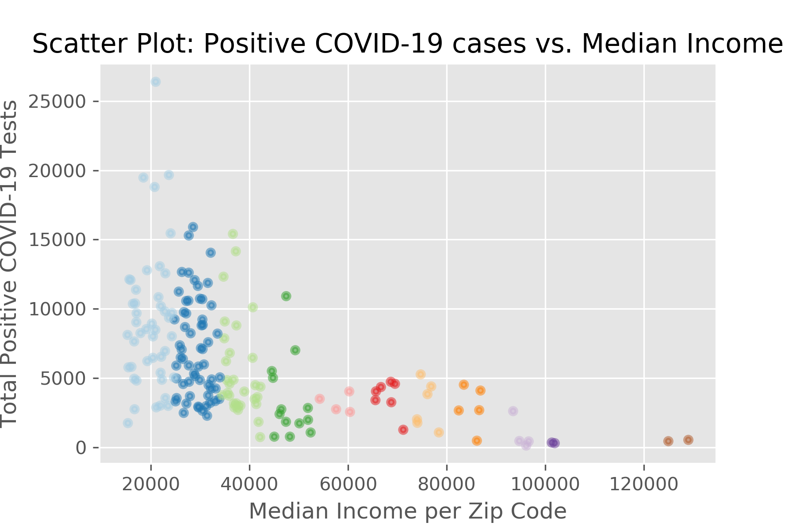
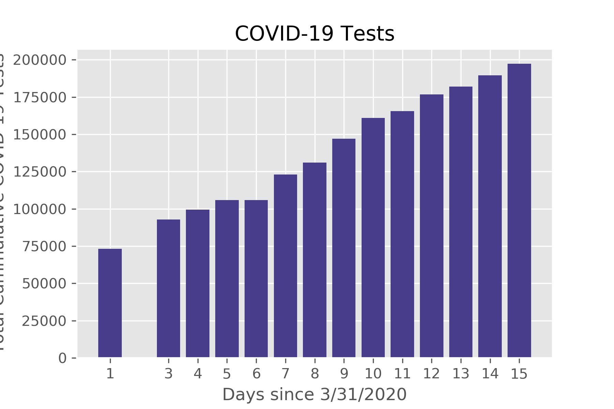
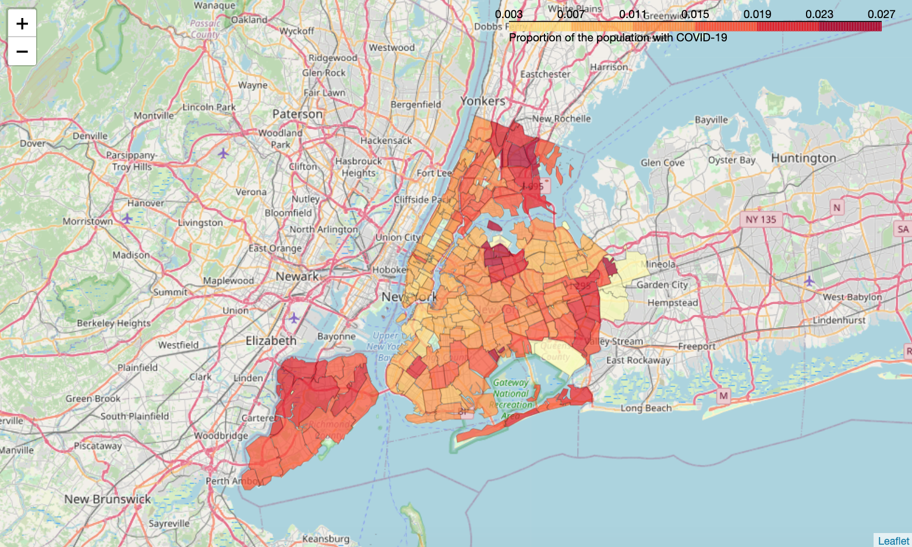

# COVID-19 in New York City
 *Data Science Capstone*
## Introduction

The COVID-19 pandemic has devastated New York City. Not since 9/11 has the city faced such a crisis. One factor driving both economic decline and increased fatalities is the pronounced public health disparities in NYC. Several politicians have referred to New York as a “tale of two cities”: one in which certain individuals prosper and others spiral due to poverty. Boroughs such as the Bronx and Queens, containing the majority of the city’s working class population, have been disproportionately affected by both COVID-19 cases and deaths. 

In this project, we will utilize machine learning techniques with open-source data and quantify the impact of group-level social factors on COVID-19 prevalence. Ideally, we hope this will inform public health policy to implement interventions based on prevention; this will prevent further devastation from a second COVID-19 wave in Fall 2020.  

## Data Description

### Data Sources:

The data on COVID-19 prevalence by zip code was obtained from the New York City Department of Mental Hygiene. Time was incorporated as a variable as we used datasets documenting metrics from April 1 to April 15, 2020. Shape files of New York City’s zip codes were obtained from Open Data NYC. Demographic info on economic metrics per zip code were queried from the US Census using the ‘CensusData’ package. To locate hospitals in each zip code and visualize clustering, we utilized Foursquare’s API for Developers.

### Data Cleaning & Feature Selection:

Fourteen datasets for each day in April, containing positive and total test counts, were downloaded from the NYC Department of Health GitHub and combined. The DOHMH did not release any numbers for Day 2. We also downloaded Census Data from the 5 year American Community Survey from 2012 - 2017 on a zip code level and joined the data to all NYC zip codes. As a proxy for socioeconomic status, we used the median income per the zip code. The COVID-19 data from the DOHMH contained a category for cases without an assigned zip code; those could not be matched with a median income. For the purposes of this project, we chose to exclude these values from our analyses.  We chose to use both total counts and percentages for model building and predictive analyses.

## Methods

### Exploratory Data Analysis

The following table lists the primary features of interest:

Variable Name | Variable Definition | Measurements 
------------- | ------------- | -------------
*date* |**Days since 3/31/2020** | min = 1, max = 15
*Positive* | **Positive Tests** | In the 13 days analyzed, an average of **467** COVID-19 tests were positive per zip code.
*Total* | **Test Counts** | In the 13 days analyzed, an average of **815** COVID-19 tests were completed per zip code.
*MODZCTA* | **Zip Code** | A total of **177** zip codes had COVID-19 data.
*median_income* | **Median Income** | The average value of the median incomes was **$45,940.74** (SD = $22.083.24, min = $15,296.00, max = $129,028.00). 

We used exploratory scatterplots to visualize the following correlations:

|                   	| ZCTA 	| Positive 	| Total 	| date 	| cumulative percent positive 	| median_income 	| pop total 	| covid prop 	| covid prop pcnt 	|
|-------------------	|---------	|----------	|-------	|------	|-------------------	|---------------	|-----------	|------------	|-----------------	|
| ZCTA           	| 1.0     	| 0.19     	| 0.09  	| 0.0  	| 0.59              	| -0.41         	| 0.14      	| 0.24       	| 0.24            	|
| Positive          	| 0.19    	| 1.0      	| 0.97  	| 0.37 	| 0.54              	| -0.45         	| 0.73      	| 0.59       	| 0.59            	|
| Total             	| 0.09    	| 0.97     	| 1.0   	| 0.4  	| 0.41              	| -0.39         	| 0.74      	| 0.56       	| 0.56            	|
| date              	| 0.0     	| 0.37     	| 0.4   	| 1.0  	| 0.06              	| 0.0           	| -0.0      	| 0.59       	| 0.59            	|
| cumulative percent positive 	| 0.59    	| 0.54     	| 0.41  	| 0.06 	| 1.0               	| -0.76         	| 0.39      	| 0.5        	| 0.5             	|
| median income     	| -0.41   	| -0.45    	| -0.39 	| 0.0  	| -0.76             	| 1.0           	| -0.44     	| -0.34      	| -0.34           	|
| population total         	| 0.14    	| 0.73     	| 0.74  	| -0.0 	| 0.39              	| -0.44         	| 1.0       	| 0.01       	| 0.01            	|
| covid prop        	| 0.24    	| 0.59     	| 0.56  	| 0.59 	| 0.5               	| -0.34         	| 0.01      	| 1.0        	| 1.0             	|
| covid prop pcnt   	| 0.24    	| 0.59     	| 0.56  	| 0.59 	| 0.5               	| -0.34         	| 0.01      	| 1.0        	| 1.0             	|

#### Plots: 

### Relationships of Interest
Based on the correlation matrix, we identified four relationships of interest:

1. Number of positive cases vs total population ($\rho$ = 0.73)

2. Total COVID-19 tests (regardless of test result) vs total population ($\rho$ = 0.74)

3. Day in April vs proportion of population testing positive for COVID-19 ($\rho$ = 0.59)

4. Median income vs the cumulative number of COVID-19 cases  ($\rho$= -0.75)

Additionally, we ran a model examining the proportion of COVID-19 cases per zip code as a function of the median income, the zip code’s population, and the date variable.

### Querying Hospitals + Clustering
Using Foursquare, we downloaded geodata on the closest locations resulting from a “hospital” search. The origin location were the coordinates (40.7128, -73.99), near the Financial District.

## Results

### Regression/Machine Learning Models

For each of these models, we partitioned our dataset into 80% training data and 20% testing data. We started with the most flexible model and progressed to the most stringent one.

#### Number of positive cases vs total population 
| Model | R^2 | RMSE |
| ------------- | ------------- | ------------- |
| Linear Regression  | 0.02 | 253.14 |       
| Ridge Regression | 0.02  | 253.15 |       
| kNN | 0.52 | 255.14 |       

#### Total COVID-19 tests (regardless of test result) vs total population

| Model | R^2 | RMSE |
| ------------- | ------------- | ------------- |
| Linear Regression  | 0.15 | 376.20 |            
| Ridge Regression | 0.15 | 376.20 |            
| kNN | 0.36 | 447.51 |     

#### Day in April vs proportion of population testing positive for COVID-19
| Model | R^2 | RMSE |
| ------------- | ------------- | ------------- |
| Linear Regression  | - 0.72      |    0 |        
| Ridge Regression | - 0.72      |    0 |    
| kNN | N/A | 625.72 |     

####  Proportion of population testing positive for COVID-19 vs the median income
| Model | R^2 | RMSE |
| ------------- | ------------- | ------------- |
| Linear Regression  | -7.41 | 0.00 |           
| Ridge Regression | -7.42| 0.00 |            

####  COVID-19 rate = Date + Median Income + Zip Code Population 
| Model | R^2 | RMSE |
| ------------- | ------------- | ------------- |
| Linear Regression  | -0.15  | 0.00 |            
| Ridge Regression |  -0.15 | 0.00 |            

**Fitted model**: COVID-19 proportion = 0.00856069 + -8.39835811e-08  * (Median Income) + 6.40945643e-04 * (Date) +  -3.00243272e-08 *(Population in Zip Code)

### Geospatial Analyses

The map below depicts the proportion of COVID-19 cases (the raw count over the population per zip code) per zip code. Clusters in the Queens and the Bronx indicate disproportionate prevalence.  

When querying 50 hospitals in the vicinity, the following zip-codes had multiple hospitals:

Zip Code | Count
------------- | -------------
10016 | 5
10003 | 3
10029 | 3
10014 | 2
10021 | 2
10032 | 2
11203 | 2
10065 | 2

## Conclusion

More appropriate modeling (specific to infectious diseases), including exponential and logarithmic functions are necessary to fit the data. Based on visualizations and plots, however, it is clear that locations in New York City experience the impact of COVID-19 quite differently. More granular, individual data is necessary to make more sound conclusions concerning the impact of social determinants of health during this pandemic.

## URLS for Datasets

1. https://github.com/nychealth/coronavirus-data/blob/master/tests-by-zcta.csv

2. https://geo.nyu.edu/catalog/nyu-2451-34509
